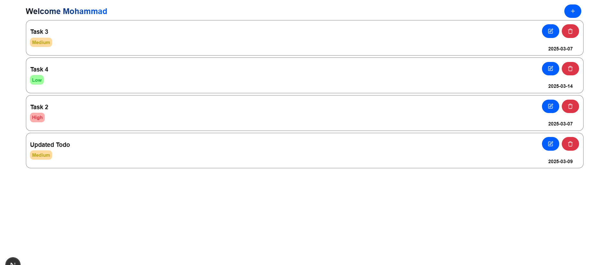
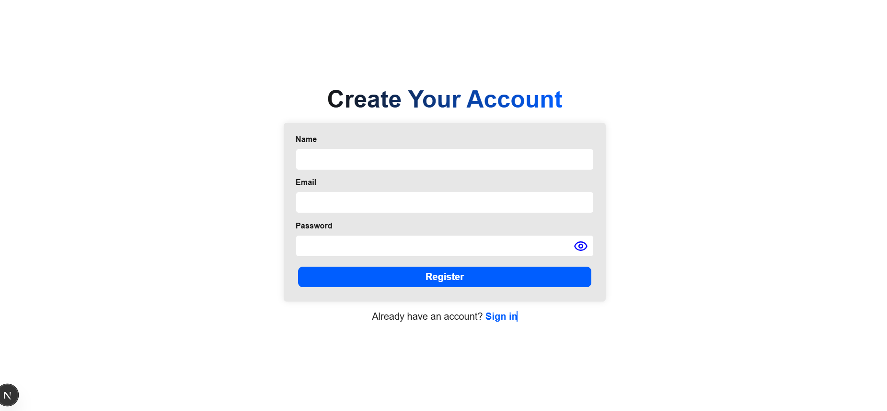
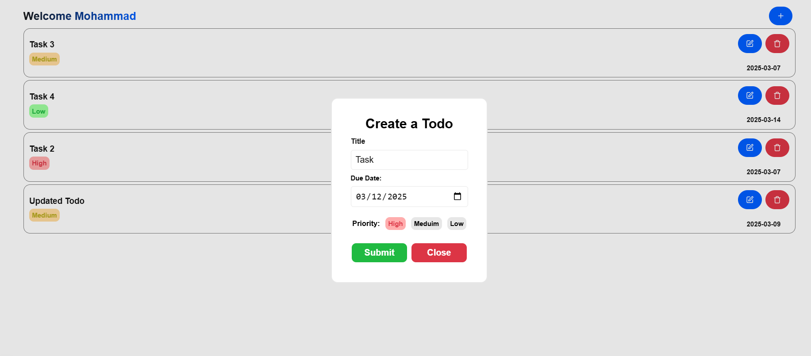
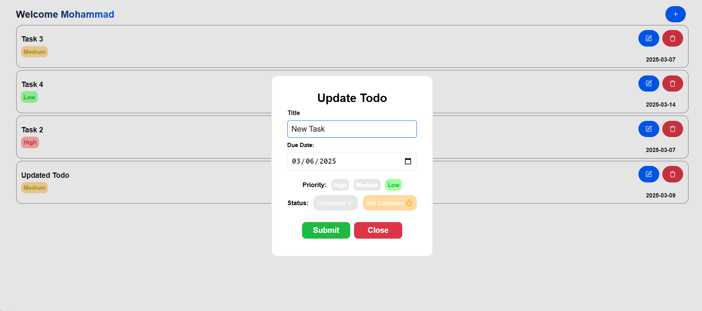
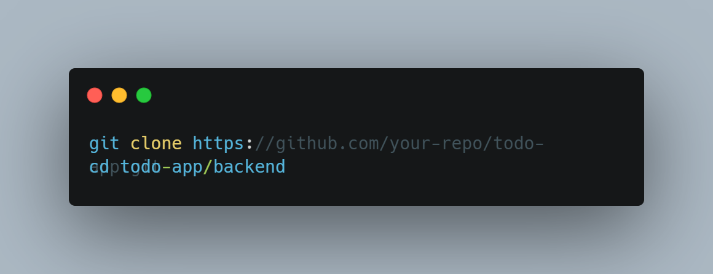

# Todo App

### This is a full-stack Todo application built with NestJS (for the backend) and Next.js (for the frontend). The application supports basic CRUD operations and includes authentication using JWT (JSON Web Tokens). It is built with TypeScript for both frontend and backend.

## Features

- User authentication (login & register) with JWT
- Create, read, update, and delete todos
- Todos have a description, priority level (1, 2, or 3), due date, and completion status
- Secure API endpoints with authentication
- Modern UI using Next.js

## Tech Stack

- Backend (NestJS)
- NestJS (TypeScript-based Node.js framework)
- Prisma (ORM for database interaction)
- PostgreSQL (Database)
- JWT (Authentication)

  
## Frontend (Next.js)

- Next.js (React framework for SSR & CSR)
- React Hook Form + Zod (Form handling & validation)

## Installation

- Prerequisites
- Ensure you have the following installed:
- Node.js (LTS version recommended)
- PostgreSQL

## Backend Setup (NestJS)

1- Clone the repo:

2- Install dependencies: 
.png)  
3- Configure environment variables:
  - Create a .env file in the backend directory.
  - Add the following variables:
  - .png)

4- Run database migrations: 
.png)  
5- Start the backend server: 
.png)  

## Frontend Setup (Next.js)

1- Navigate to the frontend directory:  
.png)  
2- Install dependencies:  
.png)  
3- Start the Next.js development server: 
.png)  

## Running the App

Once both backend and frontend are running, open http://localhost:3000 in your browser to access the Todo App.
